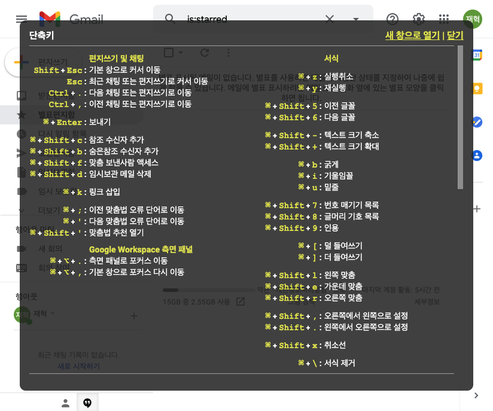
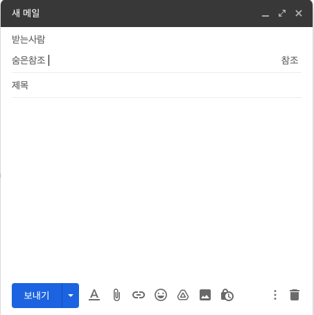
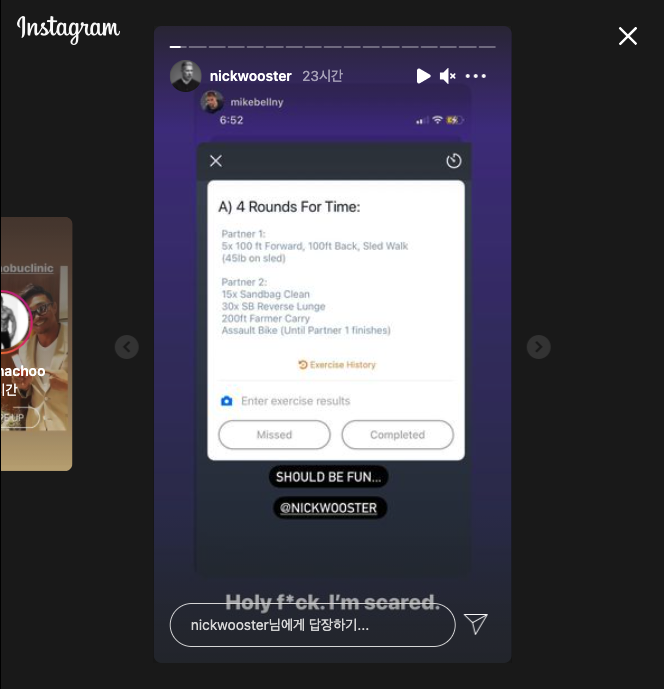
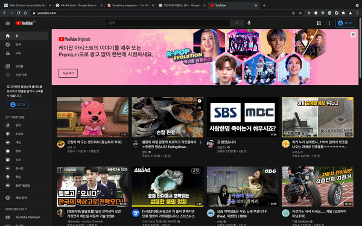
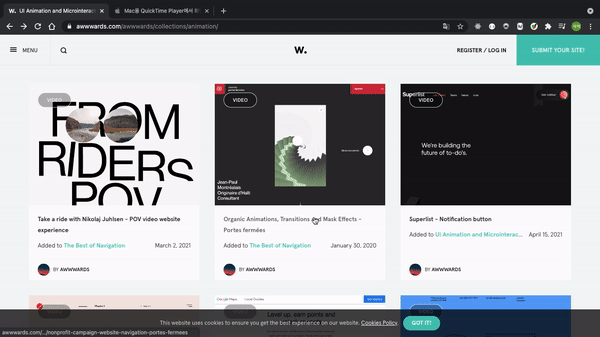
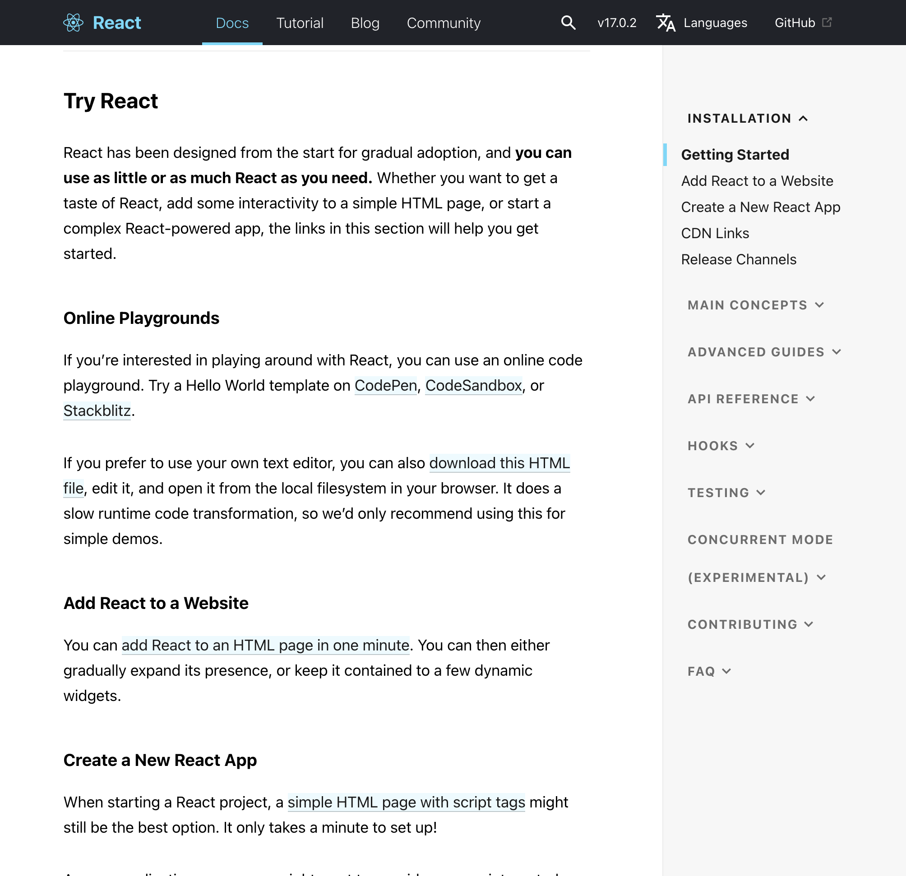
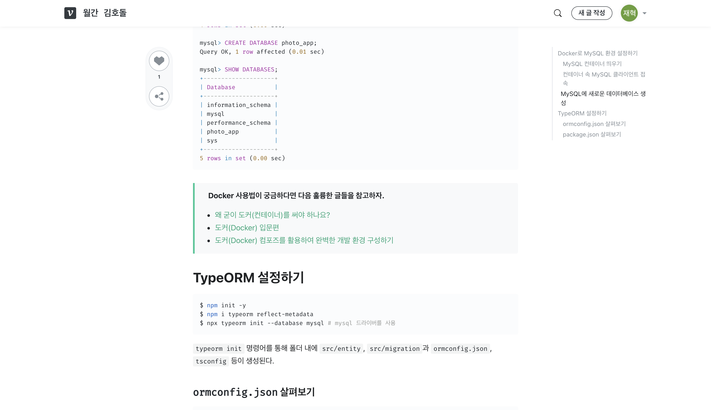
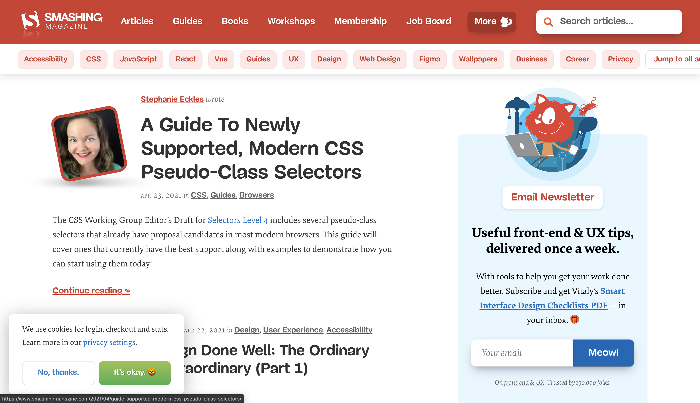

# 2. 운용의 용이성(Operable)

## 이 글의 목적과 순서

이 글에서는 Accessibility Guidelines Working Group이 발행한 WCAG(Web Content Accessibility Guidelines) 중 두 번째 주제인 '운용의 용이성(Operable)'의 내용을 정리하고 해당 가이드라인을 잘 준수한 웹 사이트를 소개하고자 한다. 이 글은 다음의 순서로 전개해가고자 한다.

1. WCAG 중 운용의 용이성(Operable)을 준수하기 위한 기준 소개
1. 각 기준을 준수한 웹 사이트 소개

## 1. WCAG 중 운용의 용이성(Operable) 내용 소개

운용의 용이성은 해당 웹 페이지의 사용자 인터페이스를 구성하는 요소와 네비게이션이 운용 가능해야 함을 의미한다. 운용이 용이해야 함이 의미하는 것은 장애가 없는 일반인의 입장에서는 물론 시각, 청각, 지적 장애 등을 가지고 있는 장애인의 입장에서도 웹 페이지의 구성요소들에 접근하고 이용이 가능해야 한다는 것이다. WCAG에서는 운용의 용이성을 평가하는 기준을 다음과 같이 5가지로 제시하고 평가의 단계를 세 가지(A, AA, AAA)로 구분한다.

- 키보드 접근성(Keyboard Accessible)
- 충분한 시간(Enough Time)
- 발작 및 신체적 반응(Seizures and Physical Reactions)
- 네비게이션 가능(Navigable)
- 입력 방식(Input Modalities)

### 2.1 평가 기준 1 - 키보드 접근성(Keyboard Accessible)

키보드로 모든 기능을 사용할 수 있어야 한다. 이를 평가하는 세부 충족 기준은 아래와 같이 4가지로 나뉜다.

#### 충족 기준 2.1.1 키보드

- 설명

개별 키 입력을 위한 특정 타이밍이 요구되지 않는 키보드 인터페이스를 통해 모든 콘텐츠의 기능을 이용할 수 있어야 한다. 단, 콘텐츠의 기본 기능에 끝점(endpoints)뿐만 아니라 사용자의 이동 경로 입력이 필요한 경우는 예외로 한다.

> 참고 1
> 이 예외는 기본 기능과 관련되지만, 입력 기법은 아니다. 예를 들어 손글씨(handwriting로 텍스트를 입력한다면, 입력 기법(손기술)은 경로의존적인(path-dependent) 입력이 필요하지만, 기본 기능인 텍스트 입력은 경로의존적인 입력을 필요로 하지 않는다.

> 참고 2
> 이 충족 기준은 키보드 조작 외에 마우스 입력이나 다른 입력 방법을 제공하는 것을 금지하지 않으며, 금지해서도 안 된다. 즉, 장애인/비장애인의 구분없이 해당 콘텐츠를 이용하는 데에 불편함이 없어야 한다.

- 사례: [W3 WCAG 페이지](https://www.w3.org/TR/WCAG21/)

_`Tab`키를 통한 사이드바 접근_

**충족 기준 2.1.1 키보드** 조건을 만족한 사례는 이 글의 참고 자료가 된 W3 WCAG 페이지이다. 페이지에 처음 들어가서 `Tab`키를 누르면 가이드라인의 목차로 이동가능한 영역이 포커스되며 Mac의 voice over와 같은 정보보조장치에 의해 해당 영역이 어떤 콘텐츠를 가지고 있는지를 알려준다.

- 위 조건 충족 시 level A

#### 충족 기준 2.1.1 키보드 함정 방지

- 설명

키보드 인터페이스(가령 Tab 키)를 사용하는 키보드 포커스를 페이지의 구성요소로 이동할 수 있는 경우, 키보드 인터페이스만으로도 해당 구성요소에서 포커스를 이동시킬 수 있어야 한다. 수정되지 않은 화살표, 탭 키, 또는 다른 표준 종료 방법이 필요한 경우, 사용자에게 포커스를 이동시키는 방법에 대해 안내해야 한다.

> 참고
> 이 충족 기준을 충족하지 못하는 콘텐츠는 모든 페이지를 사용하는 사용자들의 능력을 방해할 수 있다. 웹 페이지의 모든 콘텐츠는 다른 충족 기준의 충족 여부와 관계없이 반드시 이 충족 기준을 준수해야 한다.

- 사례1: [W3 WCAG 페이지](https://www.w3.org/TR/WCAG21/)

_`Tab`키를 통한 링크 접근 1_
.png>)

_`Tab`키를 통한 링크 접근 2_
.png>)

_`Tab`키를 통한 링크 접근 3_
.png>)

`Tab`키를 눌러 본문 콘텐츠에 접근하면 _링크 접근1_, _링크 접근2_, *링크 접근3*과 같이 콘텐츠에 포함된 링크를 위에서 아래로, 왼쪽에서 오른쪽으로 건너뛰며, 해당 영역이 다른 URL로 연결가능한 링크임을 알려준다. 키보드의 `Tab`키를 이용하여 링크와 같은 사용자와 인터렉티브한 콘텐츠에 접근가능함을 보여주는 사례다.

- 사례 2: [patientslikeme.com/symptoms](https://www.patientslikeme.com/symptoms)

_`Tab`키를 통한 콘텐츠 열기_
.png>)

`Tab`키를 눌러 해당 페이지의 콘텐츠에 접근하다보면, 위의 사진과 같이 원래는 가려져 있지만 `Tab`키를 눌러 숨겨져있던 아코디언 메뉴 형식의 콘텐츠를 확인할 수 있다. 해당 대메뉴에서 `Tab`키를 누르면 인터렉티브한 소메뉴에 접근할 수 있고 포커스된 콘텐츠에서 `Enter`키를 누르면 해당 콘텐츠 링크로 이동이 가능하다.

- 위 조건 충족시 Level A

#### 충족 기준 2.1.3 키보드(예외 없음)

- 설명

콘텐츠의 모든 기능은 개별 키 입력에 대한 특정 시간종료(timeout)을 요구하지 않는 키보드 인터페이스를 통해 운용 가능해야 한다.

- 사례

위에서 제시한 사례 모두 개별 키 입력에 대한 특정 시간종료를 요구하지 않는다. 위의 사례가 이 조건의 사례가 될 수 있다.

- 위 조건 충족 시 Level AAA

#### 충족 기준 2.1.4 문자 단축키

- 설명

키보드 단축키를 문자(대문자 및 소문자), 구두점, 숫자 또는 기호만 이용하도록 구현할 경우, 다음 중 하나 이상을 준수해야 한다.

| 준수사항                                         | 설명                                                                                                               |
| ------------------------------------------------ | ------------------------------------------------------------------------------------------------------------------ |
| **해제(Turn off)**                               | 단축키를 끌 수 있는 매커니즘을 제공해야 한다.                                                                      |
| **재설정(Remap)**                                | 하나 이상의 인쇄 불가능한 문자(가령, Ctrl, Alt 등)를 사용하여 단축키로 재설정(remap)하는 매커니즘을 제공해야 한다. |
| **포커스 시에만 활성화(Activate only on focus)** | 사용자 인터페이스 구성요소의 단축키는 해당 구성요소가 포커스 받았을 때만 활성화되어야 한다.                        |

- 사례: 구글 gmail

_구글 gmail 단축키_

_편지쓰기에서 숨은 참조 추가하기_

구글 gmail 설정에서 **키보드 단축키 사용**을 선택하고 gmail에서 `?`키를 클릭하면 gmail에서 사용가능한 모든 단축키를 확인할 수 있다.

모든 단축키는 `편지쓰기 및 채팅` 등의 구성요소가 포커스 받았을 때만 활성화되고 그 외의 구성요소(화면)에서는 해당 단축키는 작동하지 않는다. 이는 위의 준수사항에서 세 번째 `포커스 시에만 활성화` 조건을 준수한 사례이다.

- 위 조건 충족 시 Level A

### 2.2 평가기준 2 - 충분한 시간(enough time)

사용자가 콘텐츠를 읽고 사용할 수 있도록 충분한 시간을 제공해야 한다.

#### 충족 기준 2.2.1 시간 제한 조정 가능

- 설명

콘텐츠에 의해 설정된 시간 제한의 경우, 다음 중 하나 이상을 준수해야 한다.

| 준수사항                             | 설명                                                                                                                                                                   |
| ------------------------------------ | ---------------------------------------------------------------------------------------------------------------------------------------------------------------------- |
| **해제(Turn off)**                   | 시간 제한이 시작되기 전에 사용자가 시간 제한을 해제할 수 있어야 한다.                                                                                                  |
| **조정(Adjust)**                     | 시간 제한이 시작되기 전에 사용자가 넒은 범위(기본 설정 길이의 10배 이상) 내에서 제한 시간을 조정할 수 있어야 한다.                                                     |
| **연장(Extend)**                     | 사용자는 시간 만료 최소 20초 전에 경고를 받고, 간단한 동작[예: "스페이스바를 누르시오("press the space bar")"]을 사용하여 제한 시간을 10회 이상 연장할 수 있어야 한다. |
| **실시간 예외(Real-time Exception)** | 시간 제한이 필수적이며 이에 대한 다른 대안이 없는 실시간 이벤트(예: 경매)인 경우는 예외이다.                                                                           |
| **필수 예외(Essential Exception)**   | 시간 제한이 필수적이며 제한 시간 연장이 활동을 무효화하는 경우는 에외이다.                                                                                             |
| **20시간 에외(20 hour Exception)**   | 제한 시간이 20시간을 초과하는 경우는 예외이다.                                                                                                                         |

> 참고
> 이 충족 기준은 사용자가 콘텐츠나 맥락에서 시간 제한에 의해 나타나는 예상치 못한 변동 사항없이 과업을 완료할 수 있도록 보장한다. 이 충족 기준은 사용자 행동의 콘텐츠나 맥락의 변경을 일으키는 것에 대한 제한 기준인 충족 기준 3.2.1 포커스 시와 함께 고려되어야 한다.

- 위 기준 준수시 Level A

#### 충족 기준 2.2.2 일시정지, 중지, 숨김

- 설명

이동, 깜빡임, 스크롤, 자동 업데이트의 경우, 다음의 모든 사항을 준수해야 한다.

| 준수기준                                             | 설명                                                                                                                                                                                                                                                       |
| ---------------------------------------------------- | ---------------------------------------------------------------------------------------------------------------------------------------------------------------------------------------------------------------------------------------------------------- |
| **이동, 깜빡임, 스크롤(Moving, blinking, scolling)** | 사용자가 콘텐츠의 이동, 깜박임, 스크롤을 일시정지, 중지, 숨김할 수 있는 메커니즘을 제공해야 한다. 단, (1) 자동 시작, (2) 5초 이상 지속, (3) 다른 콘텐츠와 병행하여 표시되는 콘텐츠가 활동에 필수적인 구성요소인 경우는 예외이다.                           |
| **자동 업데이트(Auto-updating)**                     | 사용자가 자동 업데이트 정보를 일시정지, 중지, 숨김할 수 있는 기능, 또는 업데이트의 빈도를 조절할 수 있는 메커니즘을 제공해야 한다. 단, (1) 자동 시작, (2) 다른 콘텐츠와 병행하여 표시되는 자동 업데이트 정보가 활동에 필수적인 구성요소인 경우는 예외이다. |

- 사례: 인스타그램 스토리
  

위의 사례에서 시간 제한이 있는 스토리 내용을 더 보기 위해 스페이스바를 누르면 시간 제한이 멈춘다. 이는 위의 준수 기준 중 **연장(extend)** 과 **이동**, **깜박임**, **스크롤(Moving, blinking, scolling)** 에 해당하는 사례다.

- 위 기준 충족 시 level A

#### 충족 기준 2.2.3 시간제한 없음

- 설명

비대화형(non-interactive) 동기화된 미디어와 실시간 이벤트의 경우를 제외하고, 시간제한(timing)은 콘텐츠에 필수적으로 제공되어야 하는 이벤트나 활동이 아니다.

- 위 기준 준수 시 Level AAA

#### 충족 기준 2.2.4 작업방해 금지

- 설명

응급상황과 관련된 작업방해(interruptions)를 제외하고, 사용자는 작업방해를 연기하거나 차단할 수 있어야 한다.

- 사례: 페이스북 알림 설정
  

페이스북에서는 본인에게 오는 모든 소식의 푸쉬를 해제할 수 있다.

- 위 기준 준수 시 Level AAA

#### 충족 기준 2.2.5 재인증

- 설명

인증세션이 종료되었을 경우, 사용자는 재인중 후 데이터 손실없이 지속적으로 이용할 수 있어야 한다.

- 위 기준 준수 시 Level AAA

#### 충족 기준 2.2.6 시간종료

- 설명

사용자가 아무런 활동을 하지 않은 상황에서도 데이터가 20시간 이상 보존되지 않는 한, 사용자에게 데이터의 손실을 초래할 수 있는 사용자 비활동 상태에 대해 알려주어야 한다.

- 사례: 농협은행

### 2.3 평가 기준 3 - 발작 및 신체적 반응

콘텐츠는 발작 또는 신체적 반응을 일으키지 않도록 설계되어야 한다.

#### 충족 기준 2.3.1 번쩍임을 3회 또는 임계값 이하로 설정

- 설명

웹 페이지는 초당 3회 이상 번쩍이는 콘텐츠를 포함해서는 안된다. 또는 번쩍임은 일반 번쩍임과 적색 번쩍임 임계값 이하로 설정해야 한다.

> 이 충족 기준을 준수하지 못하는 콘텐츠는 사용자가 전체 웹 페이지를 사용하는 것을 방해할 수 있으므로, 웹 페이지의 모든 콘텐츠는 (다른 충족 기준의 준수 여부와 상관없이) 이 충족 기준을 준수해야 한다.

- 위 기준 충족 시 Level A

#### 충족 기준 2.3.2 3회 번쩍임

- 설명

웹 페이지는 초당 3회 이상 번쩍이는 콘텐츠를 포함해서는 안된다.

- 사례: 유튜브 메인페이지
  

유튜브 메인페이지의 경우 한번에 로드하는 콘텐츠가 많고 각 콘텐츠의 썸네일이 번쩍임을 유발할 수 있음에도 불구하고 메인페이지의 콘텐츠의 대부분이 로드될 때까지 대체 이미지가 노출되고 콘텐츠 로드가 완료되면 한번에 보여지는 것을 알 수 있다. 이를 분석하면 대체 이미지가 보일 때 한 번의 번쩍임으로 콘텐츠가 로드되고 있음을, 콘텐츠가 로드됐을 때 한 번의 번쩍임을 보여 사용자 입장에서 명확하게 콘텐츠를 인식할 수 있는 사례다. 3회를 넘지 않는 번쩍임을 이용하여 콘텐츠의 로딩 정보를 명확하게 보여줄 수 있었던 사례이기도 하다.

- 위 기준 충족 시 Level AAA

#### 대화형 에니메이션

- 설명

인터렉션(interaction)에 의해 촉발되는 모션 애니메이션은 기능 조작이나 정보 전달을 위해 반드시 필수적인 경우가 아니라면 비활성화 할 수 있어야 한다.

- 사례: [어워즈 닷컴](https://www.awwwards.com/awwwards/collections/animation/)

위의 사이트는 인터렉티브 애니메이션을 잘 적용한 웹사이트를 소개하는 어워즈 닷컴이다. 각 사이트의 인터렉티브 애니메이션이 페이지가 로드되면 한꺼번에 보여지는 것이 아닌 이용자가 해당 사이트 영역에 마우스를 가져가면 해당 애니메이션이 보이는 형태이다. 마우스 호버라는 인터렉션에 의해 촉발되는 모션 애니메이션이 마우스 호버 해제시 비활성화 되는 사례다.

- 위 기준 충족 시 Level AAA

### 2.4 평가 기준 4 - 네비게이션 가능(Navigable)

사용자에게 네비게이션하고, 콘텐츠를 찾고, 현재 위치를 파악할 수 있는 방법을 제공해야 한다.

#### 2.4.1 충족 기준: 블록 건너뛰기

- 설명

여러 웹 페이지에 걸쳐 반복되는 콘텐츠 블록이 있는 경우, 이를 건너뛸 수 있는 메커니즘을 제공해야 한다.

- 위 조건 충족 시 Level A

#### 2.4.2 충족 기준: 제목(title)이 있는 페이지

- 설명

웹 페이지는 주제나 목적을 설명하는 제목을 포함해야 한다.

- 사례: 애플뮤직
  

위 애플뮤직의 사례에서 네비게이션을 통해 이동한 모든 페이지의 상단에는 `둘러보기`와 같이 해당 페이지의 제목/기능이 포함되어 있다.

- 위 조건 충족 시 Level A

#### 2.4.3 충족 기준: 포커스 순서

- 설명

웹 페이지를 순차적으로 탐색할 수 있고 탐색 순서가 의미 또는 운용(operation)에 영향을 주는 경우, 포커스할 수 있는 요소들은 의미와 운용가능성(operability)이 유지되는 순서로 포커스를 받아야 한다.

- 위 조건 충족 시 Level A

#### 2.4.4 충족 기준: 링크 목적(맥락에서)

- 설명

각 링크의 목적은 링크 텍스트만으로 식별 가능하거나 프로그래밍 방식으로 결정된 링크 맥락과 함께 식별 가능해야 한다. 단, 링크의 목적이 전반적으로 사용자에게 애매한 경우는 제외한다.

- 사례: [reactjs 공식 페이지](https://reactjs.org/docs/getting-started.html)

위의 사례에서 한 페이지에 많은 링크가 있는데 그 중에서 중간에 `download this HTML file` 링크가 눈에 띈다. 해당 링크를 클릭하면 기본 HTML file 다우로드 페이지로 연결된다. 링크 텍스트만으로 해당 링크의 목적을 명확히 구현된 사례다.

- 위 조건 충족 시 Level A

#### 2.4.5 충족 기준: 다양한 방법

- 설명

웹 페이지 세트 내에 위치한 특정 웹 페이지를 찾을 수 있는 방법을 한 가지 이상 제공해야 한다. 단, 웹 페이지가 과정상의 단계이거나 결과물일 경우는 제외한다

- 위 조건 충족 시 Level AA

#### 2.4.6 충족 기준: 헤딩과 레이블

- 설명

헤딩(headings)과 레이블에는 주제(topic) 또는 목적(purpose)을 기술해야 한다.

- 사례: 위의 애플뮤직이 이 기준의 사례가 될 수 있다.

- 위 조건 충족 시 Level AA

#### 2.4.7 충족 기준: 식별 가능한 포커스

- 설명

키보드로 조작할 수 있는 사용자 인터페이스는 키보드 포커스가 표시되는 작동 모드를 제공해야 한다.

- 위 조건 충족 시 Level AA

#### 2.4.8 충족 기준: 위치

- 설명

웹 사이트가 웹 페이지 세트로 구성되어 있는 경우, 사용자 위치 정보를 제공해야 한다.

- 사례: [velog.io](https://velog.io/)

위의 사례에서 오른쪽 상단에 작성자가 마크다운으로 정리한 제목부분으로 글을 구성한 부분을 일목요연하게 정리되어 있는 네비게이션이 있다. 해당 네이게이션은 콘텐츠를 보고 있는 사람에게 현재 위치의 헤딩 정보를 알려주고 네비게이션 클릭 시 해당 영역으로 이동할 수 있다.

- 위 조건 충족 시 Level AAA

#### 2.4.9 충족 기준: 링크 목적(링크만)

- 설명

링크 텍스트만으로도 각 링크의 목적을 식별 가능하게 해 주는 메커니즘을 제공해야 한다. 단, 링크의 목적이 전반적으로 사용자에게 애매한 경우는 제외한다.

- 위 조건 충족 시 Level AAA

#### 2.4.10 충족 기준: 섹션(section) 헤딩

- 설명

콘텐츠는 섹션 헤딩(headings)을 사용하여 조직화해야 한다.

- 위 조건 충족 시 Level AAA

### 2.5 평가 기준 5 - 입력 방식(Input Modalities)

사용자가 키보드 이외의 다양한 입력 장치를 통해 기능들을 보다 쉽게 조작할 수 있도록 해야 한다.

- 위 조건 충족 시 Level AAA

#### 2.5.1 충족 기준: 포인터 제스처

- 설명

멀티 포인트 또는 경로기반 제스처로 작동되는 모든 기능은 경로기반 제스처 없이 단일 포인터로 작동 가능해야 한다. 단, 멀티 포인트 또는 경로기반 제스처가 필수적인 경우는 예외이다.

> 이 성공기준은 포인터의 액션을 해석하는 웹 콘텐츠에 적용된다. (즉, 사용자 에이전트나 보조공학 조작이 요구되는 작업에는 적용되지 않는다.)

- 위 조건 충족 시 Level A

#### 2.5.2 충족 기준: 포인터 취소

- 설명

단일 포인터로 조작 가능한 기능은 다음 중 한 가지 이상을 준수해야 한다.

| 준수기준                                | 설명                                                                                                                                       |
| --------------------------------------- | ------------------------------------------------------------------------------------------------------------------------------------------ |
| **다운 이벤트 실행금지(No Down-Event)** | 포인터의 다운 이벤트 상태에서는 어떠한 기능도 실행되어서는 안 된다.                                                                        |
| **중지 또는 취소(Abort or Undo)**       | 단일 포인터를 사용한 기능은 업 이벤트 시에 실행되며, 실행 전에 기능을 중지하거나 실행 후에 기능을 취소할 수 있는 메커니즘을 제공해야 한다. |
| **되돌리기 가능(Up Reversal)**          | 업 이벤트는 앞서 실행한 다운 이벤트의 결과를 되돌릴 수 있어야 한다.                                                                        |
| **필수적인(Essential)**                 | 다운 이벤트에서 기능을 완료하는 것이 필수적이다.                                                                                           |

> 키보드 또는 숫자 키패드 키 누르기를 에뮬레이션하는 기능은 필수적인 것으로 간주된다.
> 이 성공기준은 포인터 동작으로 실행되는 웹 콘텐츠에 적용된다. (즉, 사용자 에이전트 또는 보조공학을 작동하는 데 필요한 동작에는 적용되지 않는다.)

- 위 조건 충족 시 Level A

#### 2.5.3 충족 기준: 네임(Name) 안의 레이블(Label)

- 설명

텍스트 또는 텍스트 이미지가 포함된 레이블을 가지고 있는 사용자 인터페이스 구성요소의 경우, 네임은 시각적으로 표시되는 텍스트를 포함해야 한다.

- 위 조건 충족 시 Level A

> 레이블의 텍스트는 네임(name)의 시작 부분에 제시하는 것이 가장 좋다.

#### 2.5.4 충족 기준: 모션기반 작동

- 설명
  장치나 사용자의 모션으로 작동할 수 있는 기능은 사용자 인터페이스 구성요소로 작동할 수 있어야 하며, 모션에 대한 반응은 우발적인 작동을 방지할 수 있도록 비활성화될 수 있어야 한다. 다음의 경우는 예외이다.

| 예외상황                                     | 설명                                                                          |
| -------------------------------------------- | ----------------------------------------------------------------------------- |
| **지원되는 인터페이스(Supported Interface)** | 모션이 지원되는 접근성 인터페이스를 통해 기능을 작동하기 위하여 사용되는 경우 |
| **필수적인(Essential)**                      | 모션이 기능에 필수적이고, 모션을 하면 활동을 무효화하는 경우                  |

- 위 조건 충족 시 Level A

#### 2.5.5 충족 기준: 타겟(target) 크기

- 설명

포인터 입력용 타겟의 크기는 최소한 44×44 CSS 픽셀 이상이어야 한다. 다음의 경우는 예외이다.

| 예외상황                                     | 설명                                                                                                |
| -------------------------------------------- | --------------------------------------------------------------------------------------------------- |
| **동등한(Equivalent)**                       | 타겟이 최소한 44×44 CSS 픽셀 이상인 동일 페이지에서 동등한 링크 또는 콘트롤을 통해 이용 가능한 경우 |
| **인라인(Inline)**                           | 타겟이 텍스트의 문장이나 블록 안에 있는 경우                                                        |
| **사용자 에이전트 제어(User Agent Control)** | 타겟 크기가 사용자 에이전트에 의해 결정되고 개발자에 의해 수정 불가능한 경우                        |
| **필수적인(Essential)**                      | 타겟의 특정 프리젠테이션이 전달해야 할 정보에 필수적인 경우                                         |

- 사례: [smashing magazine](https://www.smashingmagazine.com/)

위의 사례에서 `Search articles...`과 `Your email`과 같은 포인트 입력용 타겟의 크기는 각각 350*56px, 161*60px이다. 위 조건을 충족한 사례다. 입력용 타겟뿐만아나라 대부분의 요소들의 크기는 44\*44px 이상이다.

- 위 조건 충족 시 Level AAA

#### 2.5.6 충족 기준: 동시 입력 메커니즘

- 설명

웹 콘텐츠는 플랫폼 상에서 이용 가능한 입력 방식의 사용을 제한해서는 안 된다. 단, 제한이 필수적인 경우, 콘텐츠 보안이 보장되어야 하는 경우, 또는 사용자 설정을 존중해야 하는 경우는 예외이다.

- 위 조건 충족 시 Level AAA
